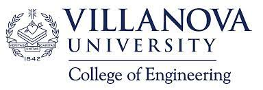

# Machine Learning Project for the VESTED Academy - Spring 2022

Authors: Raymond Ogunjimi, Cesar Nunez Rodriguez, Ahmed Abdelgalil

An experiemental machine learning project for the VESTED Academy - a Villanova University program for community engagement.

